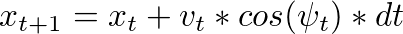
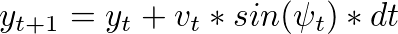
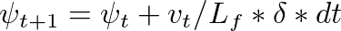
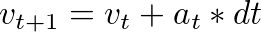
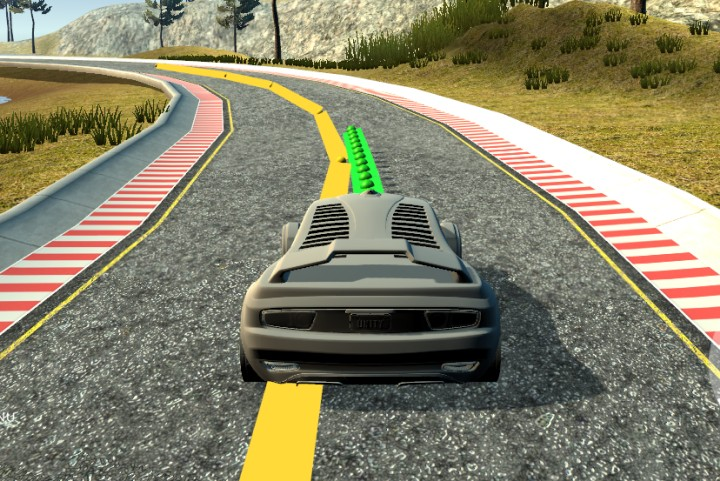
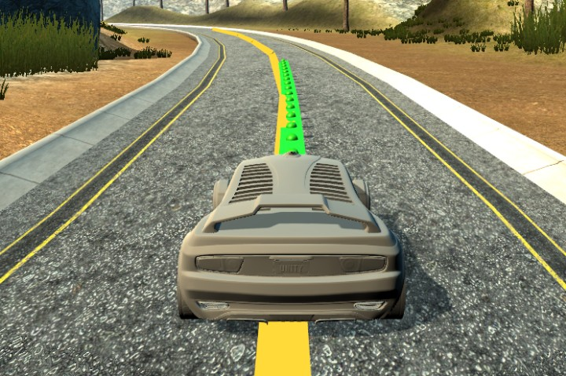
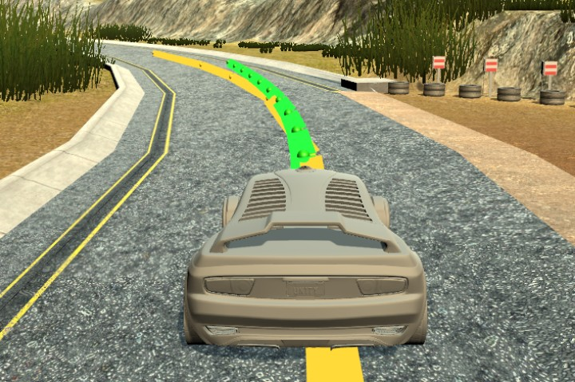

# Model Predictive Control (MPC)

## Model

This projects replaces real car with a simplified Kinematic model that ignores tire forces, gravity and mass and predicts next state based only on trigonometric considerations. 

Model state is tracked in a vector with the following variables:

- x - X position in car's coordinate 
- y - Y position 
- psi - Yaw angle in radians
- v - Velocity in meters per second

To capture how errors are changing over time the state vector includes also
- cte - Cross track error  
- epsi - Orientation error 

The goal is to calculate desired 
- delta - Steering wheel angle
- a - Acceleration from throttle and break pedals
 
The model has also hyperparameter Lt equal to distance between car's center of gravity and forward wheels in meters.   

## Timestep

First I set the prediction horizon to 1 second and split it into 20 steps.

The car was little bit unstable because it could not predict road turns in advance, so I decieded to increase the prediction horizon to 2.4 seconds. That matches good with the waypoints provided by the simulator.

Finally I reduced the number of steps to 12 to reduce the calculation effort.

- T = 2.4 seconds
- N = 12 steps
- dt = 0.2 seconds

## Preprocessing

## Handling latency