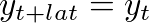
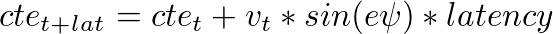

# Model Predictive Control (MPC)

## Model

This projects replaces real car with a simplified Kinematic model that ignores tire forces, gravity and mass and predicts next state based only on trigonometric considerations. 

Model state is tracked in a vector with the following variables:

- x - X position in car's coordinate 
- y - Y position 
- psi - Yaw angle in radians
- v - Velocity in meters per second

To capture how errors are changing over time the state vector includes also
- cte - Cross track error  
- epsi - Orientation error 

The goal is to calculate desired 
- delta - Steering wheel angle
- a - Acceleration from throttle and break pedals
 
The model has also hyperparameter Lt equal to distance between car's center of gravity and forward wheels in meters.   

## Timestep

First I set the prediction horizon to 1 second and split it into 20 steps.

The car was little bit unstable because it could not predict road turns in advance, so I decieded to increase the prediction horizon to 2.4 seconds. That matches good with the waypoints provided by the simulator.

Finally I reduced the number of steps to 12 to reduce the calculation effort.

- T = 2.4 seconds
- N = 12 steps
- dt = 0.2 seconds

## Preprocessing

The simulator provides waypoints in global coordinates that must be converted to car's coordinates. It also uses miles per hour for velocity measurement. The algorithm converts all distances into meters, time in seconds, angles in radians.

After conversion the waypoints are approximated with third degree polynomial using Eigen library.

## Solving the problem

Having current model state and desired waypoints the code uses Ipopt and CppAD libraries to find steering angle and acceleration that minimize loss function. The loss function s penalizes errors in car's position on the road, its orientation and speed. The loss function also penalize hard steering and fast changes in steering and acceleration.         

## Handling latency

One of the advantages of MPC algorithms compared to PID controller is the easiness of latency handling. The real-time values coming from simulator are updated with predicted changes during the latency time. In case of Kinematic model the code just predicts the vehicle will move forward with the current parameters next _latency_ seconds.

## Issues

When compiled with gcc 7 on Ubuntu 17 the Ipopt library crashes in runtime failing to find the file /usr/local/lib/libcoinmumps.so. The solution was to switch to gcc 6.4 as described [here](https://gist.github.com/application2000/73fd6f4bf1be6600a2cf9f56315a2d91) and recompile the library.        